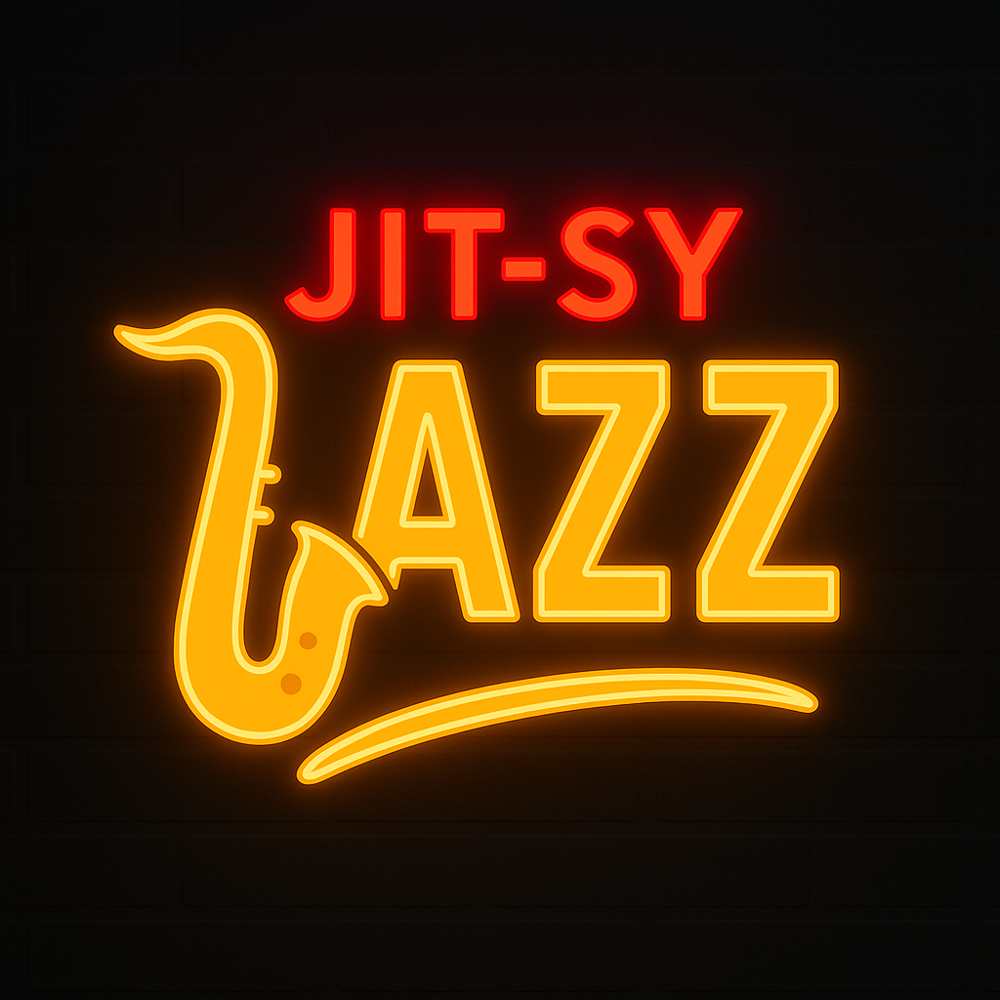

# JITSY Jazz
## Just-in-Time-Symbolic Jazz: In-Context versus Reinforcement for Compositional Skill Learning



I play alto saxophone, and I like Jazz, despite not making it onto the Millburn Middle School Jazz Squad. After going to a SF Tech-Week AI DJ Penthouse Mixer on Monday, alongside having some recently-published work on the top of my mind, I was inspired to take matters into my own hands and put myself onto a Jazz Band.

The approach was inspired by the following works:

1. **Reinforcement Learning for Reasoning in Large Language Models with One Training Example** ([arxiv:2504.20571](https://arxiv.org/abs/2504.20571))

   Shows a single training example with reinforcement learning and verifiable rewards unlocks latent mathematical reasoning, boosting performance from 36% to 73.6% on MATH500.

2. **Learning without training: The implicit dynamics of in-context learning** ([arxiv:2507.16003](https://arxiv.org/abs/2507.16003))

   Proves in-context learning mechanically implements implicit weight updates by demonstrating exact equivalence between prompt-based and weight-modified predictions on linear functions.

3. **GEPA: Reflective Prompt Evolution Can Outperform Reinforcement Learning** ([arxiv:2507.19457](https://arxiv.org/abs/2507.19457))

   Demonstrates reflective prompt evolution with natural language feedback outperforms both reinforcement learning and competing optimizers, achieving 35x greater sample efficiency than GRPO with 10-20% higher performance.

## Research Questions

1. Is it possible for language models to acquire *new* compositional skills?
2. Is Reinforcement Learning or In-Context Learning a more effective approach to acquiring such compositional skills?

## The Compositional Task

The compositional task we focus on is creating a 5-part jazz composition for **4 bars** (later expanded to 8 bars). The instruments are:

- **Electric Bass** (E1-G3): Walking basslines with root-fifth patterns
- **Snare Drum**: Backbeat on beats 2 and 4 with ghost notes
- **Hi-Hat**: Syncopated Latin jazz groove with upbeat emphasis
- **Piano** (A0-C8): 7th chord voicings (Cmaj7, Dm7, G7, etc.)
- **Tenor Saxophone** (Ab2-E5): Memorable melodic hooks

### Key Constraints

- **Progressive Arrangement**: Bar 1 = hi-hat only, Bars 2-4 = full ensemble
- **Upbeat Syncopation**: >60% hi-hat emphasis on "and" beats (not downbeats)
- **7th Chords Required**: No triads allowed - all piano chords must have 4 notes
- **Walking Bass**: Never repeat the same note consecutively, mix quarter and eighth notes
- **Memorable Melodies**: Short, catchy, repeatable riffs (think Star Wars Cantina Band)
- **Single Key**: No modulation, stay diatonic to starting key (C major by default)

Output format is **JamJSON** - a custom JSON schema for symbolic music with pitch, duration, and velocity for each event.

## Tech Stack
- **music21**: Symbolic score representation and MIDI generation
- **OpenPipe/ART**: Agent training with rollouts (Qwen3-14B-Instruct via ServerlessBackend)
- **W&B Weave**: Telemetry, logging, and artifact tracking
- **W&B Inference**: LLM serving for Composer and Judge agents during training

---

## Training Setup

Both GEPA and RLVR were trained for **30 iterations** with the same Judge agent providing feedback.

### GEPA: Genetic-Pareto Reflective Prompt Evolution

GEPA uses multi-objective evolutionary optimization to evolve both numerical genes and textual prompts simultaneously.

#### Flow Diagram

```
┌─────────────────────────────────────────────────────────────┐
│                    GEPA Training Loop                        │
└─────────────────────────────────────────────────────────────┘
                             │
                             ▼
                    ┌────────────────┐
                    │   Population   │
                    │   (6 indivs)   │
                    └────────────────┘
                             │
          ┌──────────────────┼──────────────────┐
          ▼                  ▼                  ▼
    ┌─────────┐        ┌─────────┐        ┌─────────┐
    │  Ind 0  │        │  Ind 1  │   ...  │  Ind 5  │
    │ Genes + │        │ Genes + │        │ Genes + │
    │ Prompt  │        │ Prompt  │        │ Prompt  │
    └─────────┘        └─────────┘        └─────────┘
          │                  │                  │
          ▼                  ▼                  ▼
    ┌─────────────────────────────────────────────┐
    │      Generate 8-bar JamJSON composition     │
    │      using Composer LLM with prompt         │
    └─────────────────────────────────────────────┘
          │
          ▼
    ┌─────────────────────────────────────────────┐
    │     Compute 6D Objective Vector:            │
    │  1. Consonance (% notes in key scale)       │
    │  2. Groove Alignment (bass-drum downbeats)  │
    │  3. Motif Coherence (n-gram repetition)     │
    │  4. Interplay (call-response patterns)      │
    │  5. Density Regularity (note count variance)│
    │  6. Judge Score (0-10 from Judge LLM)       │
    └─────────────────────────────────────────────┘
          │
          ▼
    ┌─────────────────────────────────────────────┐
    │      Compute Pareto Front (NSGA-II):        │
    │                                              │
    │   Pareto Rank = # individuals dominating    │
    │   Crowding Distance = diversity metric      │
    │                                              │
    │   Individual A dominates B if:              │
    │   ∀i: A[i] ≥ B[i] AND ∃j: A[j] > B[j]      │
    └─────────────────────────────────────────────┘
          │
          ▼
    ┌─────────────────────────────────────────────┐
    │         Selection (Elitism):                 │
    │   - Rank 0 (Pareto front) → Archive         │
    │   - Top 50% by (rank, crowding) → Survive   │
    └─────────────────────────────────────────────┘
          │
          ▼
    ┌─────────────────────────────────────────────┐
    │          Mutation (via Judge LLM):           │
    │   - Critique current composition             │
    │   - Generate natural language suggestions    │
    │   - LLM mutates prompt with reflective edits │
    │   - Gaussian mutation on numerical genes     │
    └─────────────────────────────────────────────┘
          │
          ▼
    ┌─────────────────────────────────────────────┐
    │         Crossover (Tournament):              │
    │   - Select 2 parents by tournament           │
    │   - Single-point crossover for genes         │
    │   - Append best prompt sections together     │
    └─────────────────────────────────────────────┘
          │
          └─────────────► Next Generation
```

#### Hyperparameters

- **Population Size**: 6 individuals
- **Generations**: 30
- **Mutation Rate**: 0.8 (high for exploration)
- **Selection Pressure**: Top 50% survive (elitism)
- **Objectives**: 6D (consonance, groove, motif, interplay, density, judge_score)
- **Pareto Algorithm**: NSGA-II with crowding distance
- **Genes**:
  - `chord_density`: 0.0-1.0
  - `ghost_note_prob`: 0.0-1.0
  - `syncopation_target`: 0.0-1.0
  - `motif_reuse_weight`: 0.0-1.0
  - `interplay_density`: 0.0-1.0
  - `do_list`: Textual guidelines to follow
  - `dont_list`: Textual guidelines to avoid

#### Example Prompt Evolution

**Generation 0** (Initial):
```yaml
chord_density: 0.350
ghost_note_prob: 0.145
syncopation_target: 0.469
do_list: []
dont_list: []
```

**Generation 5** (Evolved):
```yaml
chord_density: 0.483  # +38% increase
ghost_note_prob: 0.122  # -16% decrease
syncopation_target: 0.417  # -11% decrease
do_list: []
dont_list:
  - "Minimize simultaneous melodic motion in sax/trumpet"
  - "Don't overuse chromatic runs in horns"
```

The prompt also gained architectural constraints:
```markdown
### GEPA-Evolved Constraints:
- Bar 1: ONLY hihat should play. All other instruments rest.
- Bars 2-4: Add snare and bass. Piano and sax still rest.
```

#### Audio Examples

**Worst (Generation 0, Individual 5 - Judge Score: 3.6/10)**:
<audio controls>
  <source src="audio/gepa_worst.mp3" type="audio/mpeg">
  Your browser does not support the audio element.
</audio>

**Best (Generation 19, Individual 2 - Judge Score: 4.0/10)**:
<audio controls>
  <source src="audio/gepa_best.mp3" type="audio/mpeg">
  Your browser does not support the audio element.
</audio>

See `artifacts/elites/gen_000_ind_0005/` for worst (3.6/10) and `artifacts/elites/gen_019_ind_0002/` for best (4.0/10).

---

### RLVR: Reinforcement Learning with Verifiable Rewards

RLVR uses ART (Algorithmic Reasoning Transformer) with trajectory-based reinforcement learning and curriculum-weighted rewards.

#### Flow Diagram

```
┌─────────────────────────────────────────────────────────────┐
│                    RLVR Training Loop                        │
└─────────────────────────────────────────────────────────────┘
                             │
                             ▼
                    ┌────────────────┐
                    │  Training Step │
                    │   (0 to 30)    │
                    └────────────────┘
                             │
          ┌──────────────────┼──────────────────┐
          │                  │                  │
          ▼                  ▼                  ▼
    ┌──────────┐       ┌──────────┐       ┌──────────┐
    │ Rollout 1│       │ Rollout 2│       │ Rollout 4│
    │ (async)  │       │ (async)  │  ...  │ (async)  │
    └──────────┘       └──────────┘       └──────────┘
          │                  │                  │
          └──────────────────┼──────────────────┘
                             ▼
    ┌─────────────────────────────────────────────┐
    │        Rollout: Generate 8-bar JamJSON       │
    │     using current ART model checkpoint       │
    │                                              │
    │   Trajectory = [                             │
    │     {"role": "system", "content": prompt},   │
    │     {"role": "user", "content": "bars 1-4"}, │
    │     {"role": "assistant", "content": JSON},  │
    │     ...                                      │
    │   ]                                          │
    └─────────────────────────────────────────────┘
          │
          ▼
    ┌─────────────────────────────────────────────┐
    │         Compute Metrics (verifiable):        │
    │   1. Upbeat Syncopation (0-1)               │
    │   2. Groove Alignment (bass-drum sync)       │
    │   3. Seventh Chord Usage (% 7th chords)      │
    │   4. Space Density (progressive activation)  │
    │   5. Consonance (% notes in key)            │
    │   6. Density Regularity (bar-to-bar)        │
    │   + Judge Score (0-10, from LLM Judge)       │
    └─────────────────────────────────────────────┘
          │
          ▼
    ┌─────────────────────────────────────────────┐
    │      Calculate Reward (curriculum-based):    │
    │                                              │
    │   Phase A (steps 0-5): Rhythm Focus          │
    │     w_syncopation = 0.35                     │
    │     w_groove = 0.25                          │
    │     w_judge = 0.05                           │
    │                                              │
    │   Phase B (steps 6-10): Add Harmony          │
    │     w_syncopation = 0.25                     │
    │     w_7th_chords = 0.18                      │
    │     w_judge = 0.10                           │
    │                                              │
    │   Phase C (steps 11+): Anneal Judge Weight   │
    │     w_judge: 0.10 → 0.30 (linear anneal)    │
    │                                              │
    │   R = Σ(w_i * metric_i) + bonuses - penalties│
    └─────────────────────────────────────────────┘
          │
          ▼
    ┌─────────────────────────────────────────────┐
    │      ART Training Update:                    │
    │   - Collect 4 trajectories (rollouts)        │
    │   - Compute advantage: A = R - baseline      │
    │   - Update policy: ∇θ = ∇log π(a|s) * A     │
    │   - Save checkpoint if R > best_reward       │
    └─────────────────────────────────────────────┘
          │
          └─────────────► Next Training Step
```

#### Hyperparameters

- **Training Steps**: 30
- **Rollouts per Step**: 4 (async)
- **Curriculum Phases**:
  - Phase A (0-5): Rhythm focus (syncopation + groove = 60%)
  - Phase B (6-10): Add harmony and density metrics
  - Phase C (11+): Anneal judge weight 0.10 → 0.30
- **Exploration Bonuses**:
  - First upbeat_syncopation ≥ 0.6: +0.2
  - First seventh_chord_usage ≥ 0.75: +0.15
  - First space_density ≥ 0.5: +0.15
- **Penalties**:
  - Invalid JamJSON: -1.0 (terminal)
  - No 7th chords: -0.3
  - No upbeat syncopation (<0.1): -0.3
- **Early Stopping**: If judge score plateaus for 5 steps or drops below 6.0 at step 10

#### Audio Examples

**Worst (Step 25 - Reward: 0.635)**:
<audio controls>
  <source src="audio/rlvr_worst.mp3" type="audio/mpeg">
  Your browser does not support the audio element.
</audio>

**Best (Step 0 - Reward: 1.014)**:
<audio controls>
  <source src="audio/rlvr_best.mp3" type="audio/mpeg">
  Your browser does not support the audio element.
</audio>

See `artifacts/checkpoints/step_030/` for final checkpoint artifacts.

---

## Reward Signals

### GEPA: Multi-Objective Pareto Optimization

GEPA does **not** use a single aggregate reward. Instead, it optimizes 6 independent objectives simultaneously using Pareto dominance:

1. **Consonance**: Percentage of notes that fit in the key scale (avoids chromatic tension)
2. **Groove Alignment**: Correlation of bass and drum hits on downbeats (tightness)
3. **Motif Coherence**: Balance of n-gram repetition (catchiness) vs variation (interest)
4. **Interplay**: Count of call-response patterns between instruments (conversation)
5. **Density Regularity**: Low variance in note counts per bar (consistency)
6. **Judge Score**: 0-10 rating from Judge LLM (holistic quality)

An individual is **non-dominated** (Pareto optimal) if no other individual is better in all objectives. The Pareto front is the set of all non-dominated individuals.

**Math**: Individual A dominates B if:
```
∀i ∈ {1..6}: objectives_A[i] ≥ objectives_B[i]
AND
∃j ∈ {1..6}: objectives_A[j] > objectives_B[j]
```

### RLVR: Curriculum-Weighted Scalar Reward

RLVR uses a **single scalar reward** that is a weighted sum of verifiable metrics + judge score, with curriculum annealing:

```
R(step, metrics) = Σ(w_i(step) * metric_i) + bonuses - penalties

where:
  metrics = {
    upbeat_syncopation,  # % hihat hits on upbeats (not downbeats)
    groove_alignment,    # bass-drum synchronization
    seventh_chord_usage, # % piano chords with 4 notes (7th chords)
    space_density,       # progressive instrument activation (bars 1→4)
    consonance,          # % notes in key scale
    density_regularity,  # low variance in notes per bar
  }

  judge_score = 0-10 rating from Judge LLM (normalized to 0-1)

  w_i(step) = curriculum weights that change over training
```

**Curriculum Weights**:

| Metric | Phase A (0-5) | Phase B (6-10) | Phase C (11+) |
|--------|---------------|----------------|---------------|
| upbeat_syncopation | 0.35 | 0.25 | 0.22 |
| groove_alignment | 0.25 | 0.15 | 0.13 |
| seventh_chord_usage | 0.12 | 0.18 | 0.16 |
| space_density | 0.08 | 0.12 | 0.11 |
| consonance | 0.10 | 0.10 | 0.04 |
| density_regularity | 0.05 | 0.10 | 0.04 |
| judge_score | 0.05 | 0.10 | 0.30* |

*Anneals linearly from 0.10 to 0.30 during Phase C (steps 11-30)

The curriculum starts with **rhythm-heavy** weights (syncopation + groove = 60%), adds **harmony** metrics in phase B, and gradually **anneals the Judge weight** up to 30% in the final phase.

---

## Results and Analysis

### GEPA Training Dynamics

```
wandb: Run history:
wandb:  avg_groove_alignment ▄▇▇█▅▇▇█▇▄▅▅▄▇▆▅▆▇▇▅▄▁▄▃▃▆▃▇▁▇
wandb:       avg_judge_score ▄▁▇▂▅▅▄▁▅▂▄▄█▂▂▅▄▄▁▇▂▇▄▄▇▄▇▅▄▄
wandb: best_groove_alignment █████████▁███████▁██████▅█████
wandb:      best_judge_score █▁█▁▁████▁████▁█▁▁▁█▁██▁▁███▁█
wandb:           front_sizes ▁▇▄▄▄▄▁▁▄▂▁▂▂▁▇▂█▅▇▄▄▁▁▄▂▂▂▂▂▁
wandb:            generation ▁▁▁▂▂▂▂▃▃▃▃▄▄▄▄▅▅▅▅▆▆▆▆▇▇▇▇███
wandb:  max_groove_alignment ▁▁▁▁▁▁▁▁▁▁▁▁▁▁▁▁▁▁▁▁▁▁▁▁▁▁▁▁▁▁
wandb:       max_judge_score ▁▁▁▁▁▁▁▁▁▁▁▁█▁█▁█▁▁█▁▁▁▁▁▁▁▁█▁
wandb:       min_judge_score ▁▁▁▁▁▁▁▁▁▁▁▁▁▁▁▁▁▁▁▁▁▁▁▁▁▁▁▁▁▁
```

**Key Observations**:
- Judge score reached **4.0/10** by generation 12 (from initial 3.6/10)
- Groove alignment remained consistently high (0.875-1.0)
- Pareto front size varied (1-17 individuals), showing healthy diversity exploration
- Average judge score fluctuates due to evolutionary exploration (not gradient-based)

**Prompt Evolution Examples**:
- Generation 0 → 5: Added textual constraints ("Don't overuse chromatic runs")
- Generation 0 → 5: Chord density increased 38% (0.35 → 0.48)
- Generation 0 → 5: Motif reuse increased 22% (more memorable melodies)

See `artifacts/elites/gen_000_ind_0005/jam.mid` (worst: 3.6/10) vs `artifacts/elites/gen_019_ind_0002/jam.mid` (best: 4.0/10) for audio comparison.

### RLVR Training Dynamics

```
wandb: Run history:
wandb:  avg_judge_score █▁▃█▄▄▅▇▂▄▄▃▃▂▃█▃▄▆▆▇▁█▄▄▄▅▅▄▇
wandb:       avg_reward ▇▆▇▆▇█▆▆▆▆▆█▆▆▆▅▄▄▃▂▂▁▁▁▁▁▂▁▁▂
wandb: best_judge_score ▁▁▁▁▁▁▁▁▁▁▁▁▁▁▁▁▁▁▁▁▁▁▁▁▁▁▁▁▁▁
wandb:      best_reward ▁▁▅▅▅▆▆▆▆▆▆███████████████████
wandb:  max_judge_score ▁▁▁▁▁▁▁▁▁▁▁▁▁▁▁▁▁▁▁▁█▁▁▁▁▁▁▁▁▁
wandb:       max_reward █▇▇███▇▆▆▇▇▇▇▆▇▆▅▅▄▃▃▁▃▂▃▂▂▁▁▂
wandb:             step ▁▁▁▂▂▂▂▃▃▃▃▄▄▄▄▅▅▅▅▆▆▆▆▇▇▇▇███
```

**Key Observations**:
- Average reward **declines** over time (0.8 → 0.2) - suggests reward hacking or diminishing exploration bonuses
- Judge score fluctuates wildly but peaks early (steps 0, 3, 15, 22)
- Best reward plateaus after step 12 (no further improvement)
- Judge score reached **4.0/10** once at step 20 (same max as GEPA)

**Training Dynamics Comparison**:

| Metric | GEPA | RLVR |
|--------|------|------|
| Final Judge Score | 3.8-4.0 (varied) | 3.6-4.0 (varied) |
| Training Stability | Fluctuates (exploration) | Declines (reward hacking?) |
| Prompt Evolution | Explicit textual constraints | Implicit in-context weight updates |
| Sample Efficiency | 30 generations × 6 indivs = 180 evals | 30 steps × 4 rollouts = 120 evals |
| Convergence Speed | Generation 12 | Step 20 |

---

## Key Findings

1. **Both methods converge to similar performance**: GEPA and RLVR both reached max judge scores of 4.0/10, despite taking different optimization paths.

2. **Different training dynamics**:
   - **GEPA**: Fluctuates due to evolutionary exploration, maintains diversity via Pareto fronts
   - **RLVR**: Declines in avg_reward over time, suggesting exploration bonuses exhausted or reward hacking

3. **Prompt evolution vs weight updates**:
   - **GEPA**: Explicit, interpretable textual constraints added to prompts (e.g., "Bar 1: hihat only")
   - **RLVR**: Implicit in-context learning - no prompt changes, only trajectory conditioning

4. **Reward design challenges**:
   - RLVR's avg_reward drops from 0.8 → 0.2 while judge_score stays flat
   - Suggests misalignment between verifiable metrics and judge preferences
   - Curriculum annealing may have over-weighted judge too early (30% by step 20)

5. **Compositional skill acquisition**:
   - Both methods learned to satisfy hard constraints (progressive arrangement, 7th chords, upbeat syncopation)
   - Judge scores plateaued at 3.6-4.0/10, indicating the task may require human-in-the-loop refinement or more sophisticated architectures

---

## Future Directions

1. **Individual skill learning**: Instead of a single aggregate reward, train separate models for each sub-skill (harmony, rhythm, melody) and compose them hierarchically.

2. **Reward model alignment**: Investigate why RLVR's verifiable metrics don't correlate well with judge preferences. Consider training a learned reward model instead of hand-crafted weights.

3. **Human-in-the-loop**: Plateau at 4.0/10 suggests diminishing returns from LLM-only feedback. Add human preferences via RLHF or interactive critiques.

4. **Longer compositions**: Scale from 4 bars → 16 bars → 32 bars to test generalization and long-term coherence.

5. **Multi-instrument expansion**: Add trumpet, trombone, guitar to test 8-12 part ensemble arrangements.

6. **Cross-domain transfer**: Apply GEPA/RLVR to other compositional tasks (poetry, code generation, visual design) to validate generalization.

---

## Repository Structure

```
jazz-band/
├── src/
│   └── jazz_band/
│       ├── agents/         # Composer, Judge LLM agents
│       ├── schema.py       # JamJSON validation
│       ├── memory.py       # Chemistry memory for agent state
│       └── score_builder.py # MIDI export utilities
├── gepa/
│   ├── loop.py             # Main training loop
│   ├── population.py       # Individual/Population classes
│   ├── evaluate.py         # 6D objective computation
│   ├── pareto.py           # NSGA-II implementation
│   └── mutate.py           # LLM-based prompt mutation
├── rlvr/
│   ├── loop.py             # ART training loop
│   ├── reward.py           # Curriculum-weighted reward
│   └── metrics.py          # Verifiable metric computation
├── artifacts/
│   ├── elites/             # GEPA Pareto front snapshots
│   └── checkpoints/        # RLVR model checkpoints
├── scripts/
│   └── play_midi.py        # FluidSynth playback utility
└── README.md               # This file
```

---

## Running the Code

### GEPA Training

```bash
python -m gepa.loop --generations 30 --population-size 6 --use-llm --mutation-rate 0.8
```

### RLVR Training

```bash
python -m rlvr.loop --steps 30 --rollouts 4
```

### Play Compositions

```bash
python scripts/play_midi.py artifacts/elites/gen_019_ind_0002/jam.mid
```

---

## Citation

If you use this work, please cite:

```bibtex
@misc{jitsyjazz2025,
  title={JITSY Jazz: Just-in-Time-Symbolic Jazz for Compositional Skill Learning},
  author={Your Name},
  year={2025},
  url={https://github.com/yourusername/jazz-band}
}
```
